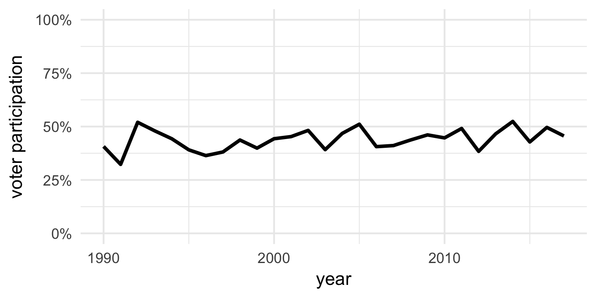

# Should I vote?

The next vote in Switzerland is up on **10. Frebruary 2019**. Now the question,
should I actually vote?  
This app helps you decide.  

## Background
It's easy and free to vote in Switzerland. In spite of that, the voter participation is usually quite low:

Source: [Bundesamt für Statistik](https://www.bfs.admin.ch/bfs/de/home/statistiken/politik/abstimmungen/stimmbeteiligung.html)

## Usage
- Select the canton you're eligible to vote.  
- Result (whether you should vote or not) is automatically updated.  

*Caution: This app just tells you if you should vote or not, it's on you to decide what to vote!*

## Acknowledgements
Thank you Mine Cetinkaya-Rundel ([@minebocek](https://twitter.com/minebocek)) for the inspiration!  
Check out her [shiny app](https://minecr.shinyapps.io/vote/).
